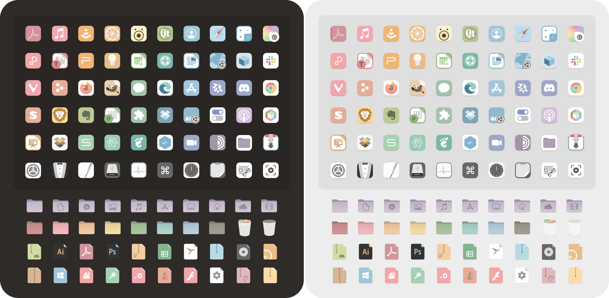

# Colloid-pastel icon theme
A pastel spin on vinceliuice's [Colloid icon theme](https://github.com/vinceliuice/Colloid-icon-theme)




## Installation:
### Easy way:
Pre-built [icon](https://www.pling.com/p/2139476) and [cursor](https://www.pling.com/p/2139483/) themes are available for download on [Pling](https://www.pling.com/u/sdonham/products).

### Fun way:
Download and extract the [zip file](https://github.com/SueDonham/Colloid-pastel-icons/archive/refs/heads/main.zip) or open a terminal and run: 
```
git clone https://github.com/SueDonham/Colloid-pastel-icons.git
``` 


[install.sh](./install.sh) script usage:  `./install.sh`  **[OPTIONS...]**

```
-d, --dest DIR          Specify destination directory (Default: $HOME/.local/share/icons)
-n, --name NAME         Specify theme name (Default: Colloid-pastel)
-c, --folder COLORS     Specify folder color variant(s) [default|blue|pink|red|orange|yellow|green|teal|grey|all] (Default: purple)
-h, --help              Show help
```
For example, to install a version with blue folders and call it Connie instead of Colloid-pastel, open a terminal in your Colloid-pastel-icons directory and run:
```
./install.sh -c blue -n Connie
```

For more information, run:
```
./install.sh -h
```

After installing the icon theme, the script will offer to install the matching [cursor themes](cursors/README.md), as well.
